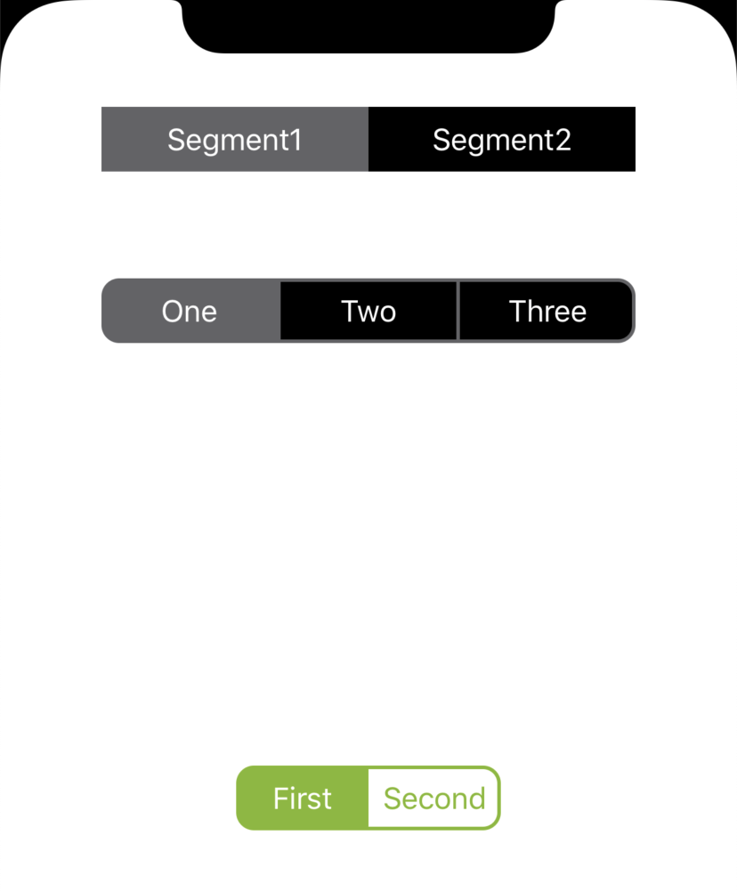
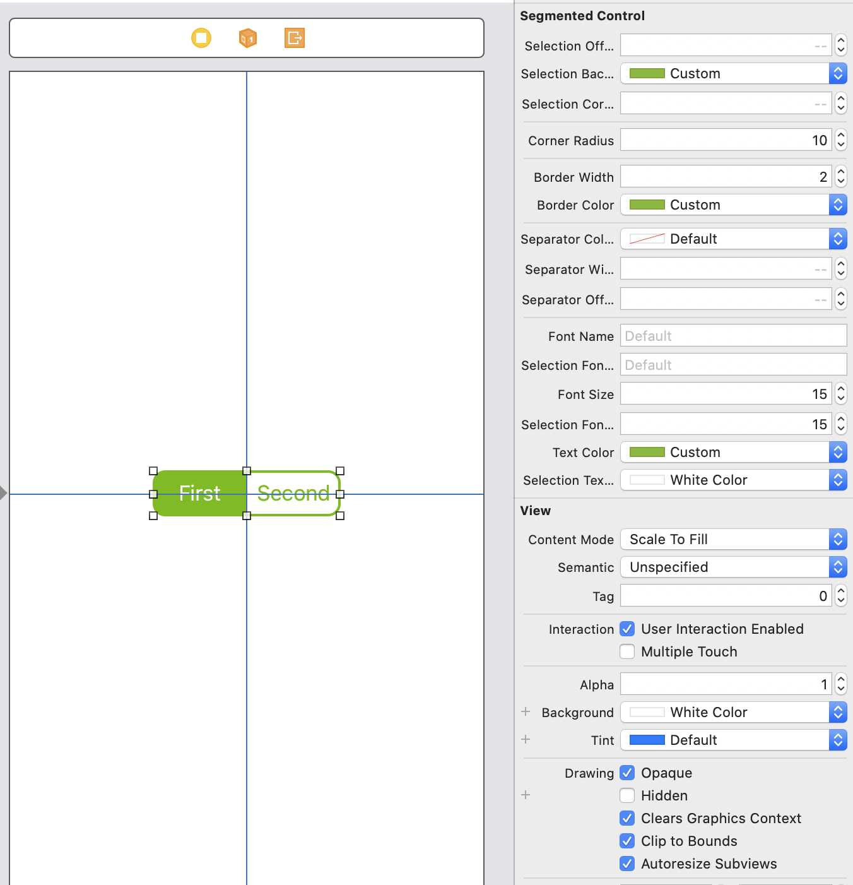

# MVSegmentedControl

[](https://travis-ci.org/Maxim Matyukov/MVSegmentedControl)
[](https://cocoapods.org/pods/MVSegmentedControl)
[](https://cocoapods.org/pods/MVSegmentedControl)
[](https://cocoapods.org/pods/MVSegmentedControl)

A highly configurable Segmented Control that can be configure in style of iOS 12 or iOS 13 or other custom style.



## Features:

- Layout implemented via constraints
- Ability to configure a control in iOS 12 or 13 or custom style.
- Designable into Interface Builder

## Requirements

- iOS 9.0+
- Xcode 11+

## Installation

_CocoaPods_

```ruby
pod 'MVSegmentedControl'
```

_Manually_

Add the TTSegmentedControl.swift file to your project.

## Usage

- Programatic:

```
let segmentedControl = MVSegmentedControl()
view.addSubview(segmentedControl)
```

- Interface Builder:

Add a UIView and set it's class to MVSegmentedControl. You can customize the control directly from the interface builder.



## Customization

You can customize the segmented control in the code.

```
let segmentedControl = MVSegmentedControl(segments: ["One", "Two", "Three"])
view.addSubview(segmentedControl)

segmentedControl.backgroundColor = .clear
segmentedControl.borderColor = .lightGray
segmentedControl.selectionBackgroundColor = .lightGray
segmentedControl.separatorColor = .lightGray
segmentedControl.borderWidth = 2
segmentedControl.separatorWidth = 2
segmentedControl.cornerRadius = 10
```

## Author

Maxim Matyukov, maxim.matyukov@gmail.com

## License

MVSegmentedControl is available under the MIT license. See the LICENSE file for more info.
